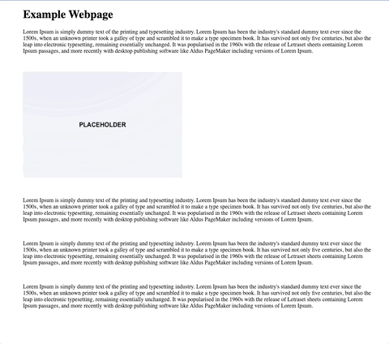

# useZoomImage

### Expand images to full screen with cool animation

## Example

<div style="width: 80%; margin: 0 auto;">
  
</div>

```jsx
import { useZoomImage } from 'useZoomImage';

function App() {
  const [showImage, setShowImage] = React.useState(false);

  const [ref, ExpandedImage] = useZoomImage(showImage, { backdrop: true });

  return (
    <div>

       setShowImage(true)} />
      {showImage && <ExpandedImage backdropOnClick={() => setShowImage(false)} />}

    </div>
  );
};
```